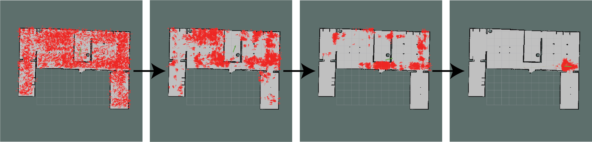

# Particle Filter

Particle filtering uses a set of particles (also called samples) to represent the posterior distribution of a stochastic process given the noisy and/or partial observations. 

Algorithm starts with $n$ independent (random variables) samples $(\xi^i_0)_{1 \le i \le n}$ representing their beliefs about the state $x_0^i$ and at the time $k=0$ their observations $y_0^i$, so that $\xi_k^i$ is a state estimate at the timestamp $k$.

$p(x_k^i | y_{1:k}^i)$ represents (probability density function) PDF OF one sample $\xi^i_k$ at the timestep $k$, given all observations $y_0^i, y_1^i, y_2^i, ..., y_k^i$, the probability of having a state $x_k^i$

$p(x_k^i | y_{1:k}^i)$ is used as weight to sample particles to discard utterly wrong estimates.

Advantage of using particle filter is good fit for multi-modal representation and non-linearity problems, since it can globally sample a state rather than highly reliant on previous states.

## Adative Particle Filter

### Likelihood-based adaptation

The number samples $n$ is adaptive according to the error carried by observations. When observations match estimation, $n$ is small, when mismatched, $n$ is big.

### KLD-sampling

Kullback-Leibler distance/divergence (KL-distance/divergence, KLD) is a measure of the difference between two probability distributions $P$ and $Q$ defined on the same probability space, $X$, the relative entropy from $Q$ to $P$ is defined
$$
D_{KL}(P || Q) = \sum_{x \in X} P(x)log(\frac{P(x)}{Q(x)})
$$

For example, when $P(x)$ is identical to $Q(x)$ distribution, $D_{KL}(P || Q)$ is $0$.

### KLD-sampling in localization

There are $n$ samples are drawn from a discrete distribution with $k$ different bins (each bin represent a set of robot states $x$).

Define max likelihood estimation of sample distribution as $\hat{p}$, and true distribution as $p$, $D_{KL}(\hat{p}||p) \le \epsilon$ is defined to contain the difference between estimation $\hat{p}$ and truth $p$ below $\epsilon$.

The number of particles should be
$$
n=\frac{k-1}{2\epsilon}
\bigg( 
    1-\frac{2}{9(k-1)} + \sqrt{\frac{2}{9(k-1)}}z_{1-\delta} 
\bigg)^3
$$
where $z_{1-\delta}$ is the upper $1-\delta$ quantile of the standard normal distribution.