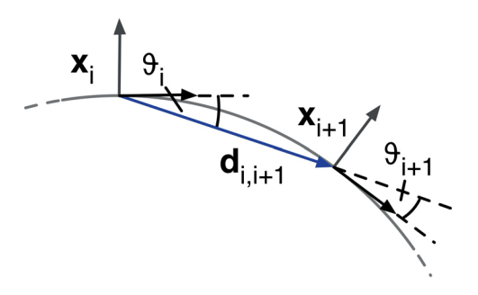

# Timed Elastic Band

Define a sequence of $n$ intermediate robot poses $\bold{x}_i=(x_i, y_i, \theta_i) \in \mathbb{R}^2 \times S^1$ ($S^1$ denotes 1-d *Special Orthogonal Group*), where $(x_i, y_i)$ represents 2-d Euclidean position and $\theta_i$ represents the robot's orientation.

Define $Q$ as a set of $n$ intermediate robot poses $\bold{x}_i$:
$$
Q=\{\bold{x}_i\}_{i=0,1,2,...,n}
$$

Define $\tau$ as a set of $n-1$ time intervals $\Delta T_i$ between two consecutive poses $[\bold{x}_i, \bold{x}_{i+1}]$
$$
\tau = \{ \Delta T_i \}_{i=0,1,2,...,n}
$$

TEB is defined as a tuple of both sequences
$$
B := (Q, \tau)
$$

Define a number of objective function $f_k(B)$ to be optimized, where $\gamma_k$ refers to relative importance/weight of different real world considerations (admissible path, obstacles, speed, acceleration, fastest path)
$$
\begin{align*}
f(B) &= \sum_k \gamma_k f_k(B)
\\
B^* &= arg \space \underset{B}{min} \space f(B)
\end{align*}
$$

The indivisual objective function $f_k(B)$ is a loss function $e_{\Gamma}$ when input $x$ exceeds a defined error bound $x_r$, zero otherwise.
$$
e_{\Gamma}(x,x_r,\epsilon,S,n)=
\left\{ 
    \begin{array}{cc}
        (\frac{x-(x_r-\epsilon)}{S})^n &\quad x>x_r-\epsilon
        \\
        0 &\quad \text{otherwise}
    \end{array}
\right.
$$

This loss function is controlled by a scaling factor $S$ and a power factor $n$, computed when the tolerance $\epsilon$ to input bound $x_r$ is violated.

## Various Real World Considerations

### Way Points and Obstables

Way points attract the elastic band whereas obstacles repel it.

$$
\begin{align*}
f_{path} &= e_{\Gamma}(d_{min,j}, r_{p_{max}}, \epsilon, S, n)
\\
f_{obstacle} &= e_{\Gamma}(-d_{min,j}, r_{o_{max}}, \epsilon, S, n)
\end{align*}
$$

where 

* $d_{min,j}$ is the current distance to to an obstacle $z_j$
* $r_{p_{max}}$ is the max robot rotation radius at a robot's future state $\bold{x}_i$ 
* $r_{o_{max}}$ is the max robot rotation radius when a robot wants to pass around an obstacle

### Velocity Constraints

A robot has hardware constraints to its velocity and acceleration.

For velocity, computations are
$$
\begin{align*}
v_i &\simeq \frac{1}{\Delta T_i} 
||
\left(
\begin{array}{c}
    x_{i+1} - x_i \\
    y_{i+1} - y_i
\end{array}
\right) 
||

\\
\omega_i &\simeq \frac{\theta_{i+1}-\theta_i}{\Delta T_i}
\end{align*}
$$

Acceleration can be expressed as
$$
a_i=\frac{2(v_{i+1}-v_i)}{\Delta T_i + \Delta T_{i+1}}
$$

Here defines objective functions to reflect such constraints:

$$
\begin{align*}
f_{v} &= e_{\Gamma}(v_i, v_{max}, \epsilon, S, n)
\\
f_{\omega} &= e_{\Gamma}(\omega_i, \omega_{max}, \epsilon, S, n)
\\
f_{a} &= e_{\Gamma}(a_i, a_{max}, \epsilon, S, n)
\end{align*}
$$

### Trajectory Arc Considerations

It is assumed that a robot's transition from $\bold{x}_i$ to $\bold{x}_{i+1}$ is continuous on an arc of the same circle. Given the property of circle that any two points on a circle share the same curvature, we can say $\vartheta_i = \vartheta_{i+1}$, so that

$$
\begin{align*}
\vartheta_i &= \vartheta_{i+1}
\\
\left(
\begin{array}{c}
    cos\theta_i \\
    sin\theta_i \\
    0
\end{array}
\right) 
\times
\bold{d}_{i,i+1}
&=
\bold{d}_{i,i+1}
\times
\left(
\begin{array}{c}
    cos\theta_{i+1} \\
    sin\theta_{i+1} \\
    0
\end{array}
\right) 
\end{align*}
$$

Transformation $\bold{d}_{i,i+1}$ is
$$
\bold{d}_{i,i+1}
=
\left(
\begin{array}{c}
    x_{i+1} - x_i \\
    y_{i+1} - y_i \\
    0
\end{array}
\right) 
$$



Hence, the objective function with respect to arc is

$$
f_{arc}(\bold{x}_i, \bold{x}_{i+1})
=
\bigg|\bigg|
    \bigg[
        \left(
            \begin{array}{c}
                cos\theta_i \\
                sin\theta_i \\
                0
            \end{array}
        \right)
        +
        \left(
            \begin{array}{c}
                cos\theta_{i+1} \\
                sin\theta_{i+1} \\
                0
            \end{array}
        \right)
    \bigg]
    \times
    \bold{d}_{i, i+1}
\bigg|\bigg|
^2
$$

### Fastest Path

A robot wants to travel to its goal as fast as possible.

$$
f_{fastest}=(\sum_{i=1}^{n} \Delta T_i)^2
$$

## Hyper-graph Optimization

The above objective functions are constructed to a hyper-graph (as opposed to normal graph, hyper-graph has its edges connecting more than two nodes).

States $\bold{x}_i$ and $\Delta T_i$ are nodes; objective functions $f_k$ are edges.

### Code Practices

```cpp
// create and init an optimizer
std::shared_ptr<g2o::SparseOptimizer> optimizer = std::make_shared<g2o::SparseOptimizer>();
g2o::OptimizationAlgorithmLevenberg* solver = new g2o::OptimizationAlgorithmLevenberg();
optimizer->setAlgorithm(solver);

// build a graph
// add TEB vertices
AddTEBVertices(); // optimizer_->addVertex(teb_.PoseVertex(i));
AddEdgesObstacles();
AddEdgesDynamicObstacles();
AddEdgesViaPoints();
AddEdgesVelocity();
AddEdgesAcceleration();
AddEdgesTimeOptimal();	
AddEdgesShortestPath();
AddEdgesPreferRotDir();
AddEdgesVelocityObstacleRatio();

// start optimization
optimizer_->initializeOptimization();
int iter = optimizer_->optimize(no_iterations);

// end of one teb generation, clear graph
auto& vertices = optimizer_->vertices();
for(auto& v : vertices)
    v.second->edges().clear();
optimizer_->vertices().clear();
optimizer_->clear();
```