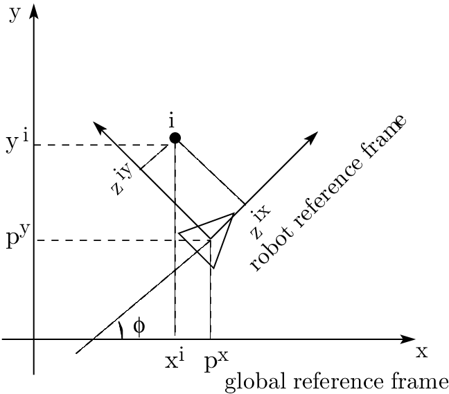

# Vehicle Properties/Measurements to Road/Track

* heading

The heading parameter describes the orientation of the vehicle in degrees, measured counter-clockwise from the X-axis of the coordinate system.

* Waypoints

The waypoints parameter is an ordered list of milestones placed along the track center.

Each waypoint in waypoints is a pair [x, y] of coordinates in meters, measured in the same coordinate system as the car's position.

* Track width

The track_width parameter is the width of the track in meters.

* Distance from center line

The distance_from_center parameter measures the displacement of the vehicle from the center of the track.

The is_left_of_center parameter is a boolean describing whether the vehicle is to the left of the center line of the track.

* All wheels on track

The all_wheels_on_track parameter is a boolean (true / false) which is true if all four wheels of the vehicle are inside the track borders, and false if any wheel is outside the track.

* Speed

The speed parameter measures the observed speed of the vehicle, measured in meters per second.

* Steering angle

The steering_angle parameter measures the steering angle of the vehicle, measured in degrees.

This value is negative if the vehicle is steering right, and positive if the vehicle is steering left.

* frame

A frame is a Cartesian Coordinate representation of an object at a time.

