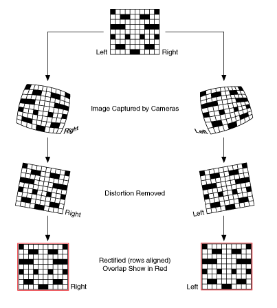

# Stereo Camera Calibration and Rectification



## Basic camera calibration and undistortion

`findChessboardCorners` takes a src image (this image can distorted) and finds the corners stored in `corners`.

`calibrateCamera` finds the optimal intrinsic and extrinsic parameters to calibrate camera and returns reprojection error
```cpp
int main(){

	cv::Mat srcImg = cv::imread("img.png", 1);

      cv::Mat grayImg;
      cv::cvtColor(srcImg,grayImg,cv::COLOR_BGR2GRAY);

	std::vector<cv::Point2f> corners;
	cv::Size boardSize(3, 4);

	bool found = findChessboardCorners(grayImg, boardSize, corners);

	if (!found){
		return -1;
	}
      else {
            // draw the image with annotated corners
            cv::drawChessboardCorners(srcMat, boardSize, corners, found);

            // object points in the real world coordinate, used to denote 3-d corner point coordinate; real world point (x, y) coordinates should correlate to chessboard corner points in terms of relative positions; since real world mapping to camera image is scalable, we can set real world points to (0,0), (0,1) ..., etc.; it is assumed projected on the z=0 real world coordinate
            objpoints{{0,0,0}, {0,1,0}, {0,2,0}, {0,3,0}, {1,0,0}, {1,1,0}, {1,2,0}, {1,3,0}, {2,0,0}, {2,1,0}, {2,2,0}, {2,3,0}};

            cv::Mat cameraMatrix; // instrinsic parameters
            cv::Mat distCoeffs; // distortion coefficients
            cv::Mat R,T; // extrinsic parameters: rotation and translation
            // calibrates camera and returns reprojection error
            double reprojError = cv::calibrateCamera(objpoints, corners, cv::Size(grayImg.rows,gray.cols), cameraMatrix, distCoeffs, R, T);

            // undistort images
            cv::Mat undistortedImg;
            cv::undistort(srcImg, imageUndistorted, cameraMatrix, distCoeffs);

      }

      return 0;
}
```

`findChessboardCorners` operation in nut shell: it binarizes an image and finds contours. It then filters out non-quandrangle convex objects. Corners of rectangles are extracted and stored in `cv::OutputArray corners_`

```cpp
bool findChessboardCorners(InputArray image_, Size pattern_size,
                           OutputArray corners_) {

      bool found = false;

      // produce a binary image by a threshold
      cv::Mat thresh_img_new = img.clone();
      icvBinarizationHistogramBased(thresh_img_new); 

      // dilate the binary image to make edges obvious
      dilate( thresh_img_new, thresh_img_new, Mat(), Point(-1, -1), 1 );

      // generate quadrangles from chessboard image   
      auto generateQuads = [&](InputArray image_,std::vector<std::vector<Point> > contours) {
            std::vector<std::vector<Point> > contours;
            std::vector<Vec4i> hierarchy;
            cv::findContours(image_, contours, hierarchy, RETR_CCOMP, CHAIN_APPROX_SIMPLE);
      };
      std::vector<std::vector<Point> > contours;
      generateQuads(image_, contours);

      // process quadrangles into chessboard corners
      processQuads(contours, out_corners);

      // further refine and map corners to src img
      cv::cornerSubPix(img, out_corners, Size(2, 2), Size(-1,-1), cv::TermCriteria(TermCriteria::EPS + TermCriteria::MAX_ITER, 15, 0.1));

      // copy as the result
      cv::Mat(out_corners).copyTo(corners_);
      return found;
}
```

`calibrateCamera` finds the optimal instrinsic and extrinsic parameters by levenberg-marquadt's method minimizing projection error.
```cpp
double cv::calibrateCamera(
      InputArrayOfArrays objectPoints,
      InputArrayOfArrays imagePoints,
      Size imageSize,
      InputOutputArray cameraMatrix,
      InputOutputArray distCoeffs,
      OutputArrayOfArrays rvecs,
      OutputArrayOfArrays tvecs,
      int flags = 0,
      TermCriteria criteria = TermCriteria(TermCriteria::COUNT+TermCriteria::EPS, 30, DBL_EPSILON) 
) {
      double findParamsByLM = [&] {

            //...

      };

      return findParamsByLM();
}
```

## Stereo camera calibration

`objectPoints`: chessboard points in the real world such as `(0,0,0), (0,1,0) ... (n,m,0)`

`imagePoints1` and `imagePoints2`

```cpp
double stereoCalibrate( InputArrayOfArrays objectPoints,
                        InputArrayOfArrays imagePoints1, InputArrayOfArrays imagePoints2,
                        InputOutputArray cameraMatrix1, InputOutputArray distCoeffs1,
                        InputOutputArray cameraMatrix2, InputOutputArray distCoeffs2,
                        Size imageSize, OutputArray R,OutputArray T, OutputArray E, OutputArray F,
                        int flags = CALIB_FIX_INTRINSIC,
                        TermCriteria criteria = TermCriteria(TermCriteria::COUNT+TermCriteria::EPS, 30, 1e-6) )
{

}
```