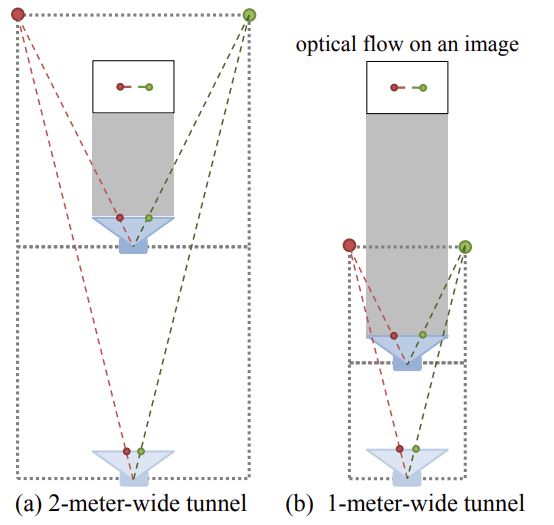
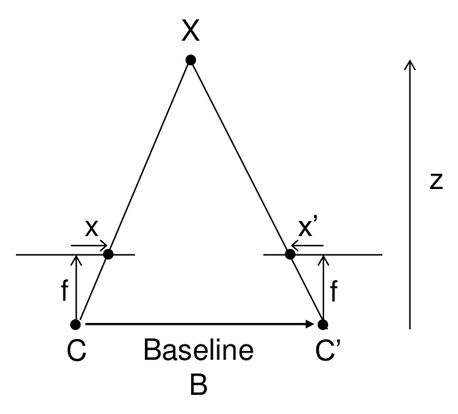

# Camera Types 

## Monocular camera

Mono camera computes depth info by selecting at least two key image frames from constant motion.

* Pros

Easy in computation and cheap

* Cons

Requiring camera constant movement/translation to find multiple key frames to detect disparity.

Scale Ambiguity: in figure (a), a camera moved forward and observed a pair of feature dots spanning two meter wide; in figure (b), a camera moved forward and observed an one-meter wide two dot feature pair. However, both scenarios see the same correspondance points on the monocular camera view, and camera itself cannot determine actual width of the feature pair, hence defined the scale ambiguity issue.

It is usually dealth with by adding other information such as sensors' input (IMU) or defining road as a plane.

## Binocular/Stereo camera

Binocular camera uses triangulation from two physical camera positions to find object point depth.

The distance vector from object point $X$ to baseline $B$ is $z$, such that
$$
Bf=z(x-x')
$$

Hence, if we know the two optical center vector $B$, focus length (vector from camera view plane to optical center) $f$, two object correspondance points (left and right) on camera views relative to epipoles, we can compute the real world object point $X$ represented by $z$.

* Pros

Not dependant on other sensors' input.

* Cons

High computation cost; complicated calibration.

## Depth camera

RGB-D camera uses infrared light or Time-of-Flight (ToF) that a camera actively radiates light and accordingly receives light signals. It computes the elapsed time between two infrared light signals, by light speed, gives the results of depth/length to the camera.

* Pros

Low depth computation resources, since a depth camera gives depth information directly.

* Cons

Highly dependant on infrared results, that infrared might be prone to errors for strong ambient light disturbance, incapability/difficult of/to penetrating some materials (such as dust and mist) to give depth results of distant object.