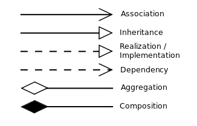
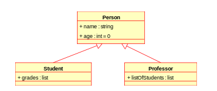
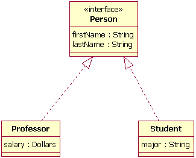
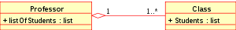

# UML (Unified Modeling Language)

## Notations

* `+` Public
* `-` Private
* `#` Protected
* `~` Package/NamespaceGroup



## Examples and explains

* Association: relationship between classes,


```cpp
class Person {
public:
    Person();
    ~Person();
    subscribe(std::string& magazineName);
}

class Magazine {
public:
    Magazine();
    ~Magazine();
}
```

* Inheritance: 


```cpp
class Person {
public:
    Person();
    ~Person();
    int age;
    std::string name;
};

class Student : public Person {
public:
    Student();
    ~Student();
    std::list<int> grades;
};

class Professor : public Person {
public:
    Professor();
    ~Professor();
    std::list<int> listOfStudents;
};
```

* Realization/Imeplementation:
serves as interfaces.

Only virtual functions are allowed in interfaces.



```cpp
class Person {
public:
    virtual ~Person();
    std::string firstName;
    std::string lastName;

    virtual void setFirstName(std::string& name);
    virtual void setLastName(std::string& name);
};

class Student : public Person {
public:
    Student();
    ~Student();

    void setFirstName(std::string& name) {
        this->firstName = name;
    }

    void setLastName(std::string& name) {
        this->lastName = name;
    }

    std::string major;
};

class Professor : public Person {
public:
    Professor();
    ~Professor();

    void setFirstName(std::string& name) {
        this->firstName = name;
    }

    void setLastName(std::string& name) {
        this->lastName = name;
    }

    int Salary;
};
```

* Aggregation: usually used for database design for mapping relationship. 

Beware of lifecycle of dependent classes, whether they should be demised after a mapping relationship is finished.



```cpp
class Class {
private:
    std::string m_name;
    std::list<Student> students;
public:
    Class(std::string& name)
        : m_name(name)
    {}

    std::string getName() { return m_name; }
};

class Professor {
private:
    std::list<std::shared_ptr<Class>> myClasses; 
public:
    Professor(std::shared_ptr<Class> classPtr)
    {
        this->myClasses.push_back(classPtr);
    }
};
```