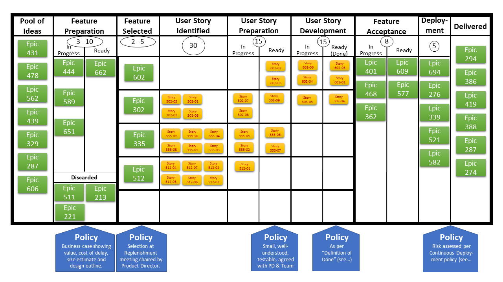

# Agile

## Kanban

Visualized sub-task billboard:

## Scrum

Small step project development framework:

* Designed for teams of ten or fewer members

* Goals that can be completed within time-boxed iterations, called *sprints*, usually two weeks

* Daily standup review of progress

* Communication with stakeholders to elicit feedbacks at each end of a sprint

* *Product owner*: representing the product's stakeholders and the voice of the customer 

* *Scrum Master*: accountable for removing impediments to the ability of the team to deliver the product goals and deliverables.

* *Product backlog*: a prioritized list of functionality which a product should contain