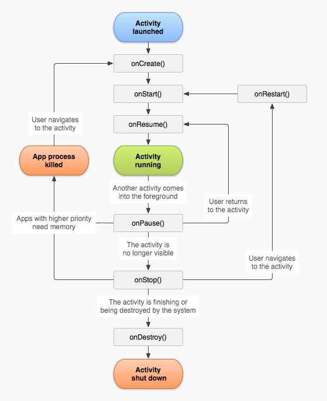

# Very Basic Android Concepts

* Startup tips:

Use Android-Studio, in which an Android emulator is procided.

Check SDK API versions in emulator in `AVD Manager`, app's SDK in `Project Structure` and system installed SDK in `Settings -> Appearance & Behavior -> System Settings`, in which they should be consistent.

In `settings.gradle`, set additional dependencies.

In `local.properties`, set SDK directory.

In `build.gradle`, set desired SDK version.

In `gradle-wrapper.properties`, set SDK/dependency download URL (mirror).

* Manifest

Inside `AndroidManifest.xml`, Activity, Service, Broadcast and Content Provider are declared for Android env registration.

* Lifecycle of the Activity



* Service methods

StartService/StopService

BindService/UnbindService：communication between Service and Activity

E.g., Music App streaming audio data controlled by user's action.

Here is a simple example, inside `AndroidManifest.xml`, register an activity and a service
```xml
<activity android:name=".ServiceExampleActivity">
    <intent-filter>
        <action android:name="android.intent.action.MAIN" />

        <category android:name="android.intent.category.LAUNCHER" />
    </intent-filter>
</activity>
<service android:name=".MyIntentService" />
```

Define a service
```kotlin
class MyIntentService : IntentService("MyIntentService") {
 
    private val TAG = "ServiceExample"
    
    override fun onHandleIntent(arg0: Intent?) {
        Log.i(TAG, "Intent Service started")
    }
}
```

Start Service
```kotlin
class ServiceExampleActivity : AppCompatActivity() {
 
    override fun onCreate(savedInstanceState: Bundle?) {
        super.onCreate(savedInstanceState)
        setContentView(R.layout.activity_service_example)
        
        val intent = Intent(this, MyIntentService::class.java)
        startService(intent)
    }
}
```

* Broadcast

It is used for message/notification push to user.

Here is an example, defines a receiver inside `<application> ... </application>` in the manifest `AndroidManifest.xml`
```xml
<receiver android:name="MyReceiver" ></receiver>
```

First register a topic
```kotlin
val filter = IntentFilter()
filter.addAction("com.example.Broadcast")
val receiver: MyReceiver = MyReceiver()
registerReceiver(receiver, filter)
```

Broadcast a message
```kotlin
val intent = Intent()
intent.action = "com.example.Broadcast"
intent.putExtra("MyData", 1000)
sendBroadcast(intent)
```

Reveive a message
```kotlin
class MyReceiver : BroadcastReceiver() {
 
    override fun onReceive(context: Context, intent: Intent) {
        // TODO: This method is called when the BroadcastReceiver is receiving
        // an Intent broadcast.
        throw UnsupportedOperationException("Not yet implemented")
    }
}
```

* Material Design

Added **Z-axis** to components' coordinates so that they look vivid in 3-dimensional space.