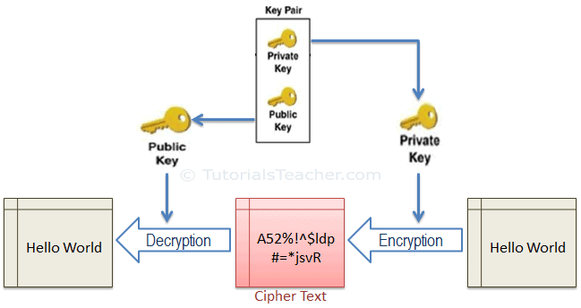
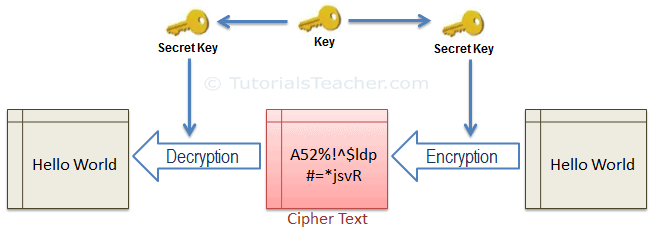
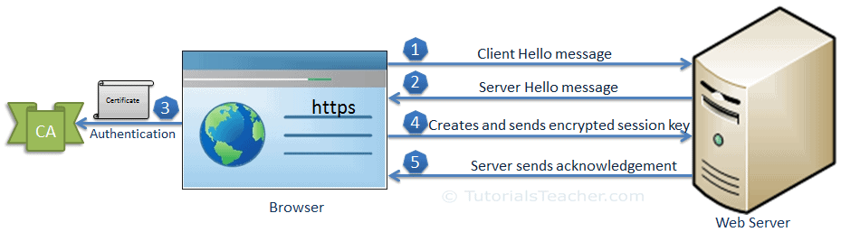
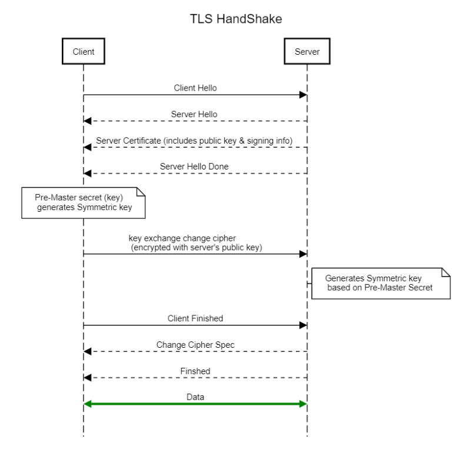
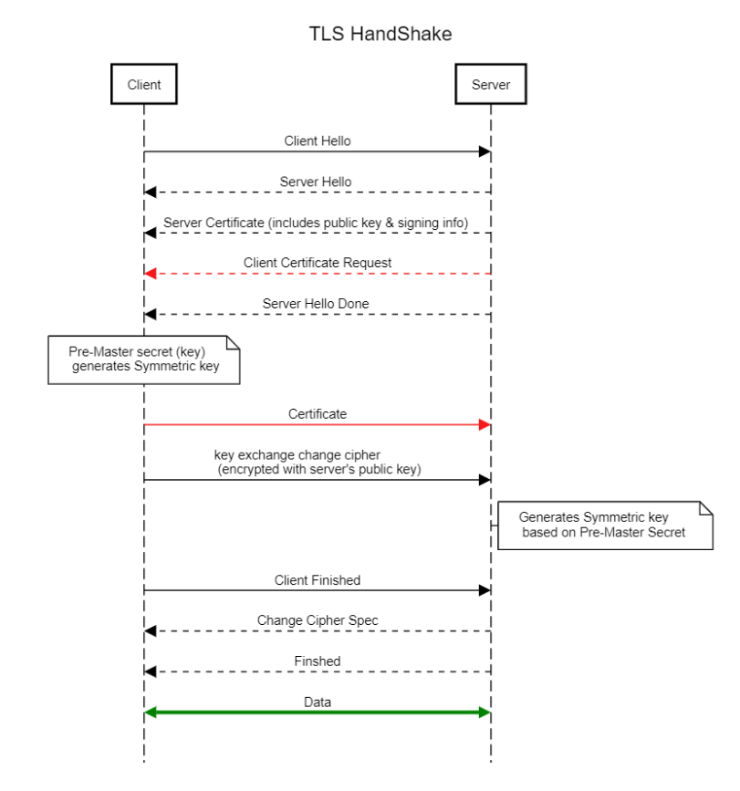

# Secure Tunneling

## Symmetric vs Asymmetric Encryption

Symmetric-key algorithms are algorithms for cryptography that **use the same cryptographic keys** for both the encryption of plaintext and the decryption of ciphertext, while asymmetric ones use diff keys.

Diffs:

* Asymmetric encryption usually uses complex mathematical operations, such as power and modulus, on very large numbers (2048 bits).
* Symmetric encryption uses simpler operations, such as XOR and multiply, on smaller numbers (64 or 128 bits)

## SSL 

`SSH tunneling` is a method of transporting arbitrary networking data over an encrypted SSH connection.

**SSL** stands for Secure Socket Layer.

The client contacts the server and sends the first message. The first message causes the client and server to exchange a few messages to negotiate the encryption algorithm to use and to pick an encryption key to use for this connection. Then the client's data is sent to the server. After this is done the client and the server can exchange information at will.

An asymmetric cryptography:

A symmetric cryptography:

An SSL handshake:

1. Hello messages contain SSL version number, cipher settings, session-specific data, etc. (browser receives the certificate served as a **public key**)
2. The client verifies the server's SSL certificate from **CA (Certificate Authority)** and authenticates the server (CA uses **private key** to perform verification)
3. The client creates a session key, encrypts it with the server's public key and sends it to the server
4. The server decrypts the session key with its private key and sends the acknowledgement

After a successful handshake, data is transferred with session key encryption.

## TLS

Transport Layer Security (TLS) is a successor of SSL, with most publicly visible use case of https.

The process is illustrated as below, that
1. Hello includes information about itself such as the ciphers it supports and the TLS versions it supports
2. a pre-master secret is calculated by the server's public key extracted from its cert, meanwhile, a symmetric key is generated
3. Server generates same symmetric key and switches to using symmetric key encryption

TLS is different from SSL in terms of 
1. Cipher suites
2. Alert messages
3. Hash algos
4. Certificate format 

### mTLS

On mTLS, both client and server need to present certificates issued by a CA, and verify whether the certificates are valid.

