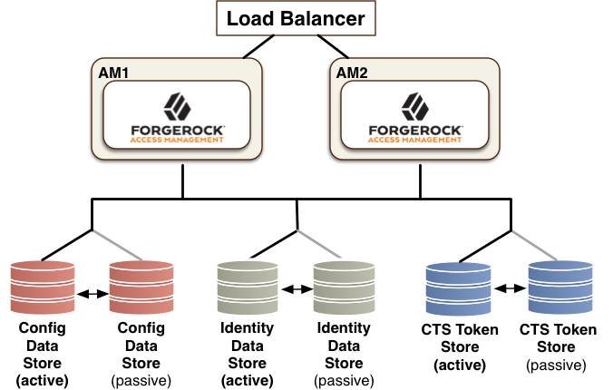

# ForgeRock

## OpenAM and OpenDJ Arch

Best architecture practice:


## ssoadm

Reference: https://wikis.forgerock.org/confluence/display/openam/OpenAM+Command+Line+Reference

ssoadm is admin console tool for various configuration.

```bash
./ssoadm update-agent -e [realmname] -b [agentname] -u [adminID] -f [passwordfile] -a com.sun.identity.agents.config.agent.protocol=[protocol]
```

`create-realm` : Create a realm
```bash
# Syntax
./ssoadm create-realm options [--global-options]

# Example
./ssoadm create-realm --realm subrealm
```

`add-svc-realm`: Add a service to a realm.
```bash
# Syntax
./ssoadm add-svc-realm options [--global-options]

# Example, -s for service, 
./ssoadm add-svc-realm --realm subrealm -s OAuth2Provider -D OAuth2Attributes.conf
```

`set-svc-attrs`: Set a service attribute
```bash
# Syntax
./ssoadm set-svc-attrs options [--global-options]

# Example, -s for service, -a for attribute
./ssoadm set-svc-attrs --realm subrealm -s OAuth2Provider -a forgerock-oauth2-provider-allow-open-dynamic-registration=true
```

`create-agent`: Create a new agent configuration.
```bash
#Syntax
./ssoadm create-agent --options [--global-options]

# Example
./ssoadm create-agent --realm subrealm --agenttype OAuth2Client -D OAuth2ClientAttributes.conf
```

`create-datastore`: Create a datastore under a realm. -t for data store types; -m name of the data store
```bash
#Syntax
./ssoadm create-datastore --options [--global-options]

# Example
./ssoadm create-datastore -e subrealm -m opendj -t LDAPv3ForOpenDJ -D dataSToreConfig.conf
```

`create-xacml`: Create policies in a realm with XACML input.
```bash
# Syntax
./ssoadm create-xacml --options [--global-options]

./ssoadm create-xacml --realm subrealm -X realm-policy.xmxl
```

`create-auth-instance`: Create an authentication instance, -t for auth type such as LDAP or DataStore; -m for name.
```bash
# Syntax
ssoadm create-auth-instance --options [--global-options]

# Example
./ssoadm create-auth-instance -e subrealm -m DataStore
```

`create-auth-cfg`: Delete existing authentication configurations.
```bash
# Syntax
ssoadm create-auth-instance --options [--global-options]

# Example
./ssoadm create-auth-instance -e subrealm -m DataStore
```