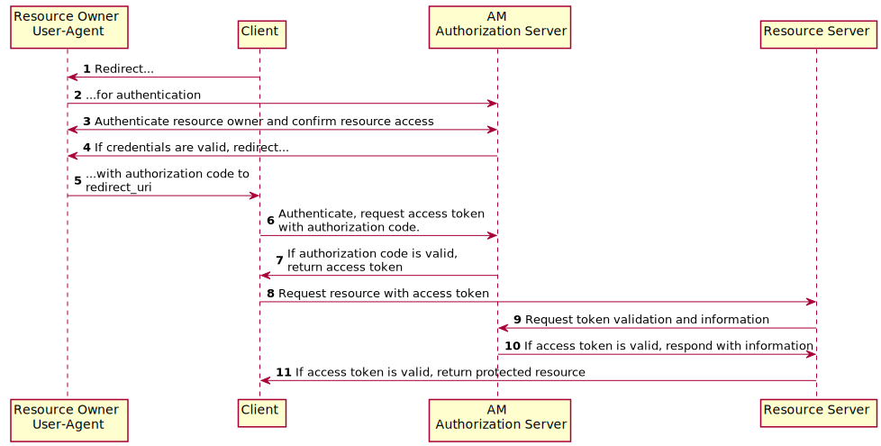
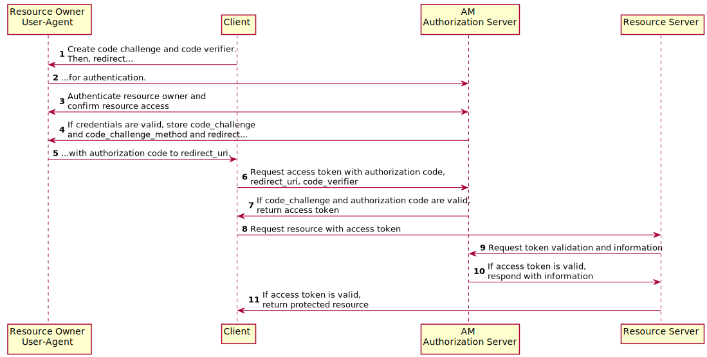
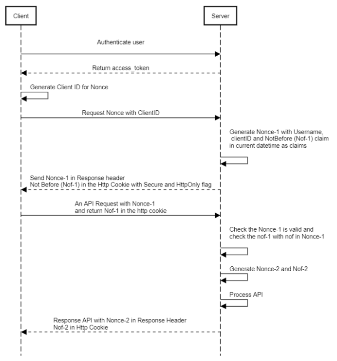
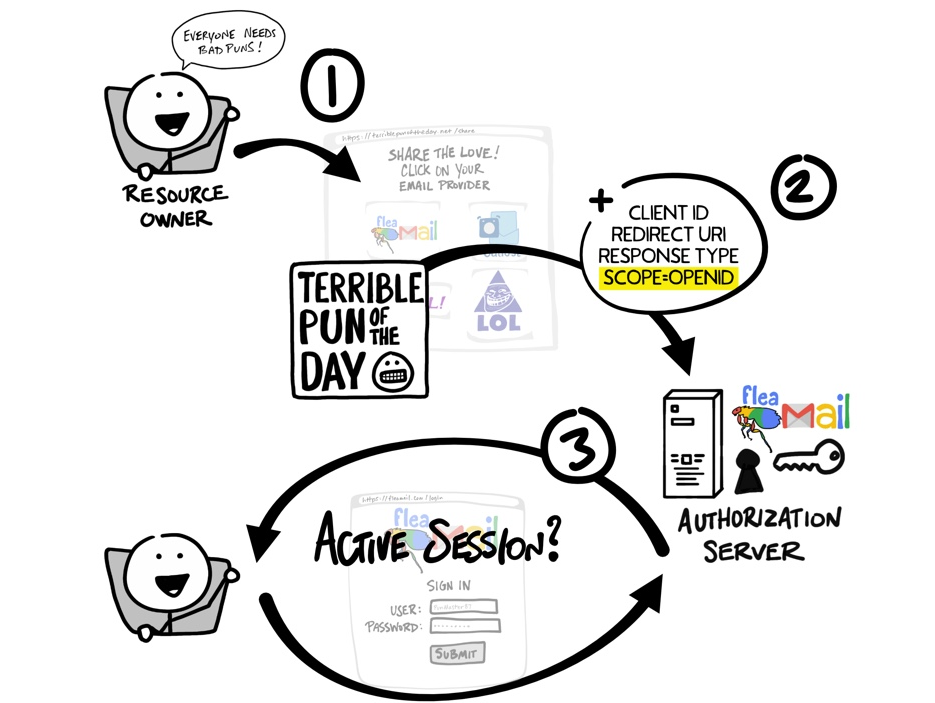

# OAuth
OAuth is an open standard for authorization, commonly used as a way for Internet users to log in to third party websites using their Microsoft, Google, Facebook, Twitter, One Network etc. accounts without exposing their password.

* id token: sso token, returned from user/client authentication.

## Token Grant 

The **authorization code** (mostly used) is obtained by using an authorization server as an intermediary between the client and resource owner.

An **access token** is a string representing an authorization issued to the client.

**Refresh tokens** are issued to the client by the authorization server and are used to obtain a new access token when the current access token becomes invalid or expires, or to obtain additional access tokens with identical or narrower scope.

### access token vs refresh token

Section 4.2 of the draft OAuth 2.0 protocol indicates that an authorization server can return both an access_token (which is used to authenticate oneself with a resource) as well as a refresh_token, which is used purely to create a new access_token.

### Authorization Code

* Client is an app.
* User is a human being
* Companies host auth server and resource server.

**Authorization Code Grant Flow**



**Authorization Code Grant Flow with PKCE**

The flow is similar to the regular Authorization Code grant type, but the client must generate a code that will be part of the communication between the client and the authorization server.

 Proof Key for Code Exchange (PKCE)



### Client Credential

Client Credentials grant is used when the client is also the resource owner and it is accessing its own data instead of acting in behalf of a user.

Client provided credentials, used as API key, etc.

For example,
```bash
curl -X POST https://localhost:8080/.../access_token
  -H "Content-Type: application/x-www-urlencoded" \
  -H "Acecept: 1.0" \
  --data-urlencoded "grant_type=client_credentials" \
  --data-urlencoded "client_id=myid" \
  --data-urlencoded "client_secret=abc123" \
  --data-urlencoded "scope=basic email"
```

### Use of Nonce

A nonce is an arbitrary number that can be used just only once in a cryptographic. 

This used to deal with access_token transmission (stateless authentication) between client and server, specially when request contains cookies.

* The nonce is generated after authentication whether first API after authentication or separate API

* Nonce JWT is generated from username, clientID which should be provided by client itself and the Not before claim set.



### Use of State

Reference:

https://auth0.com/docs/configure/attack-protection/state-parameters

As described in rfc6749, state parameter preserves some state objects set by the client in the Authorization request and makes it available to the client in the response to mitigate CSRF attacks.

Some typical generation can be
```py
state = hash('sha256', session_id())
```
```py
state = hash('sha256', client_id())
```

Init by a client for authorization to an AM server.
```bash
curl \
'https://oauth.pipedrive.com/oauth/authorize?client_id=xxx&redirect_uri=https://xxx.com/oauth2/redirect.html&state=xyzABC123'
```

This client checks if response from the AM server has same `state=xyzABC123`.

## OpenId Connect

**OpenID Connect (OIDC)** is a thin layer that sits on top of OAuth 2.0 that adds login and profile information about the person who is logged in.

### ID Token

Id Token is used for identify a user, profile scopes include:

* name
* gender
* birthdate
* avatar
* email

The differences from OAuth are, 

* Functionally speaking,

OpenID is about authentication (ie. proving who you are), OAuth is about authorisation (ie. to grant access to functionality/data/etc).

* Technically speaking,

In the initial request, a specific scope of openid is used, and in the final exchange, the Client receives both an Access Token and an ID Token. The Access Token is thus in addition having further permission for user identity information such as email and address.




## CURL Examples

reference:

https://backstage.forgerock.com/knowledge/kb/article/a45882528

https://backstage.forgerock.com/docs/am/5.5/oauth2-guide/#rest-api-oauth2-client-endpoints

* get authorization code 

```bash
# example calling endpoint
curl \
 --request POST \
 --header  "Content-Type: application/x-www-form-urlencoded" \
 --Cookie "iPlanetDirectoryPro=AQIC5w...*" \
 --data "redirect_uri=http://www.example.net" \
 --data "scope=profile" \
 --data "response_type=code" \
 --data "client_id=myClient" \
 --data "csrf=AQIC5w...*" \
 --data "decision=allow" \
 --data "save_consent=on" \
 "https://openam.example.com:8443/openam/oauth2/realms/root/authorize?response_type=code&client_id=myClient"\
 "&scope=profile&redirect_uri=http://www.example.net"

 # example response
 HTTP/1.1 302 Found
Location: http://example.com:8080/oauth?code=7rQNrZ2CpyA8dshIJFn8SX43dAk&scope=openid%20profile&iss=http%3A%2F%2Fhost1.example.com%3A8080%2Fopenam%2Foauth2&state=af0ifjsldkj&client_id=myClientID
```

* get access token

```bash
# example calling endpoint
curl \
 --request POST \
 --user "myClientID:password" \
 --data "grant_type=password&username=amadmin&password=cangetinam&scope=profile&auth_chain=myAuthChain" \
 https://openam.example.com:8443/openam/oauth2/access_token

 # example response
{
  "expires_in": 599,
  "token_type": "Bearer",
  "refresh_token": "f6dcf133-f00b-4943-a8d4-ee939fc1bf29",
  "access_token": "f9063e26-3a29-41ec-86de-1d0d68aa85e9"
 }
```

```bash
# example calling endpoint
curl https://openam.example.com:8443/openam/oauth2/realms/root/tokeninfo\
  ?access_token=f9063e26-3a29-41ec-86de-1d0d68aa85e9
    
 # example response
{
  "mail": "demo@example.com",
  "grant_type":"password",
  "scope": [
     "mail",
     "cn"
  ],
  "cn": "demo",
  "realm": "/",
  "cnf": {
     "jwk": {
        "alg": "RS512",
        "e": "AQAB",
        "n": "k7qLlj...G2oucQ",
        "kty": "RSA",
        "use": "sig",
        "kid": "myJWK"
     }
  }
  "token_type": "Bearer",
  "expires_in": 577,
  "client_id": "MyClientID",
  "access_token": "f9063e26-3a29-41ec-86de-1d0d68aa85e9"
}
```


```bash
# example calling endpoint
curl \
 --request POST \
 --data "token=d06ab31e-9cdb-403e-855f-bd77652add84" \
 --data "client_id=MyClientID" \
 --data "client_secret=password" \
 https://openam.example.com:8443/openam/oauth2/realms/root/token/revoke
  # example response
{}
```

Server exposes the public keys used to digitally sign OAuth 2.0 and OpenID Connect 1.0 access and refresh tokens at a JSON web key (JWK) URI endpoint, which is exposed from all realms for an OAuth2 provider.

```bash
# example calling endpoint
curl http://openam.example.com:8080/openam/oauth2/realms/root/.well-known/openid-configuration
# example response
{
   "id_token_encryption_alg_values_supported":[
       "RSA1_5"
   ],
   "response_types_supported":[
       "token id_token",
       "code token",
       "code token id_token",
       "token",
       "code id_token",
       "code",
       "id_token"
   ],
   "registration_endpoint":"http://openam.example.com:8080/openam/oauth2/realms/root/connect/register",
   "token_endpoint":"http://openam.example.com:8080/openam/oauth2/realms/root/access_token",
   "end_session_endpoint":"http://openam.example.com:8080/openam/oauth2/realms/root/connect/endSession",
   "scopes_supported":[
       "phone",
       "address",
       "email",
       "openid",
       "profile"
   ],
   "acr_values_supported":[

   ],
   "version":"3.0",
   "userinfo_endpoint":"http://openam.example.com:8080/openam/oauth2/realms/root/userinfo",
   "token_endpoint_auth_methods_supported":[
       "client_secret_post",
       "private_key_jwt",
       "client_secret_basic"
   ],
   "subject_types_supported":[
       "public"
   ],
   "issuer":"http://openam.example.com:8080/openam/oauth2/realms/root",
   "id_token_encryption_enc_values_supported":[
       "A256CBC-HS512",
       "A128CBC-HS256"
   ],
   "claims_parameter_supported":true,
   "jwks_uri":"http://openam.example.com:8080/openam/oauth2/realms/root/connect/jwk_uri",
   "id_token_signing_alg_values_supported":[
       "ES384",
       "ES256",
       "ES512",
       "HS256",
       "HS512",
       "RS256",
       "HS384"
   ],
   "check_session_iframe":"http://openam.example.com:8080/openam/oauth2/realms/root/connect/checkSession",
   "claims_supported":[
       "zoneinfo",
       "phone_number",
       "address",
       "email",
       "locale",
       "name",
       "family_name",
       "given_name",
       "profile"
   ],
   "authorization_endpoint":"http://openam.example.com:8080/openam/oauth2/realms/root/authorize"
}
```