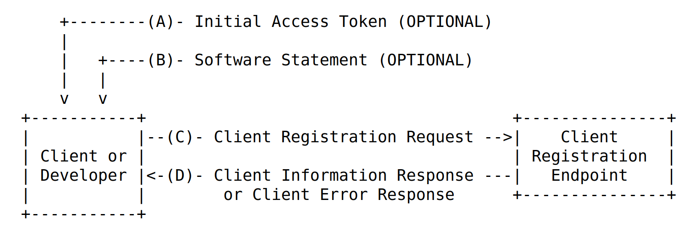
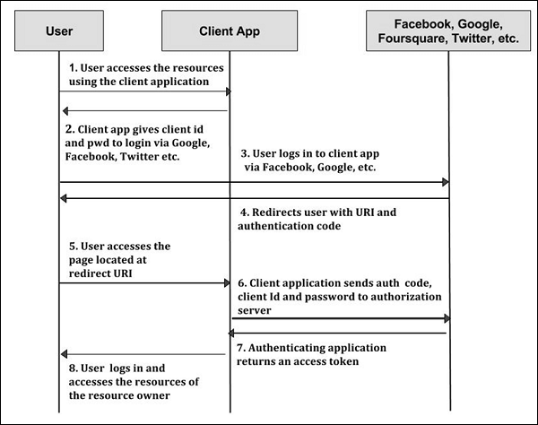

# Dynamic Client Registration

References:

https://datatracker.ietf.org/doc/html/rfc7591

https://backstage.forgerock.com/docs/am/6.5/oauth2-guide/

## Intro

**dynamic-client-registration-flow (Technical):**



**dynamic-client-registration-flow (Business):**

As illustrated in this figure, Client Registration refers to App representing resource owners (end users) to request resources from resource servers.



* Client Registration Endpoint:

OAuth 2.0 endpoint through which a client can be registered at an authorization server.

* Initial Access Token

OAuth 2.0 access token optionally issued by an authorization server to a developer or client and used to authorize calls to the client registration endpoint.

* Software Statement

A digitally signed or MACed JSON Web Token (JWT) [RFC7519] that asserts metadata values about the client software.

* Client Software Instance

A unit of a working program able to request for dynamic client registration. It can be a piece of a software system. 

* Client Metadata

The implementation and use of all client metadata fields is OPTIONAL

1. redirect_uris

2. token_endpoint_auth_method: 

one of ["none", "client_secret_post", "client_secret_basic"]

3. grant_types

["authorization_code", "implicit", "password"(resource owner password), "client_credentials", "refresh_token", "urn:ietf:params:oauth:grant-type:jwt-bearer", "urn:ietf:params:oauth:grant-type:saml2-bearer"]

4. response_types

["code"(authorization code), "token"(for implicit)]

5. client_name

6. scope

7. jwks_uri

uri for client's public keys.

8. jwks

This field MUST be a JSON object containing a valid JWK Set.

9. software_id

uuid to identify the client software to be dynamically registered. Unlike "client_id", which is issued by the authorization server and SHOULD vary between instances.

## Example Curl for Client Registration

**Below, illustration by Forgerock as authorization servers** (others include Facebook, Google, etc.)

For example, the app client sends 
```bash
curl \
 --request POST \
 --header "Content-Type: application/json" \
 --data '{
 "redirect_uris": ["https://client.example.com:8443/callback"],
 "client_name#en": "My Client",
 "client_name#ja-Jpan-JP": "\u30AF\u30E9\u30A4\u30A2\u30F3\u30C8\u540D",
 "client_uri": "https://client.example.com/"
 }' \
 "https://openam.example.com:8443/openam/oauth2/register"
```

Without other specifications, the response is
```json
{
 "request_object_encryption_alg": "",
 "default_max_age": 1,
 "application_type": "web",
 "client_name#en": "My Client",
 "registration_client_uri": "https://openam.example.com:8443/openam/oauth2/register?client_id=2aeff083-83d7-4ba1-ab16-444ced02b535",
 "client_type": "Confidential",
 "userinfo_encrypted_response_alg": "",
 "registration_access_token": "4637ee46-51df-4901-af39-fec5c3a1054c",
 "client_id": "2aeff083-83d7-4ba1-ab16-444ced02b535",
 "token_endpoint_auth_method": "client_secret_basic",
 "userinfo_signed_response_alg": "",
 "public_key_selector": "x509",
 "authorization_code_lifetime": 0,
 "client_secret": "6efb5636-6537-4573-b05c-6031cc54af27",
 "user_info_response_format_selector": "JSON",
 "id_token_signed_response_alg": "HS256",
 "default_max_age_enabled": false,
 "subject_type": "public",
 "jwt_token_lifetime": 0,
 "id_token_encryption_enabled": false,
 "redirect_uris": ["https://client.example.com:8443/callback"],
 "client_name#ja-jpan-jp": "クライアント名",
 "id_token_encrypted_response_alg": "RSA1_5",
 "id_token_encrypted_response_enc": "A128CBC_HS256",
 "client_secret_expires_at": 0,
 "access_token_lifetime": 0,
 "refresh_token_lifetime": 0,
 "request_object_signing_alg": "",
 "response_types": ["code"]
 }
```

Specifications about this app client reside on Forgerock opendj-cfg.

## Client Auth

Clients are required to proof their identity by providing CA-signed X.509 certificates (PKI) or jwks when self-signed.

1. CA-signed X.509 certificates (PKI)

Place CA's root and intermediate certs on Fogerock's `keystore.jceks`

2. jwks when self-signed

```bash
curl \
 --request POST \
 --header "Content-Type: application/json" \
 --data '{
    "jwks": {
        "keys": [{
            "kty": "EC",
            "crv": "P-256",
            "x": "9BmRru-6AYQ8U_9tUFhMGVG-BvC4vRthzLJTntfSdBA",
            "y": "MqPzVSeVNzzgcR-zZeLGog3GJ4d-doRE9eiGkCKrB48",
            "kid": "a4:68:90:1c:f6:c1:43:c0",
            "x5c": [
                "MIIBZTCCAQugAwIB.....xgASSpAQC83FVBawjmbv6k4CN95G8zHsA=="
            ]
        }]
    },
    "client_type": "Confidential",
    "grant_types": ["authorization_code", "client_credentials"],
    "response_types": ["code", "token"],
    "redirect_uris": ["https://client.example.com:8443/callback"],
    "token_endpoint_auth_method": "self_signed_tls_client_auth",
    "tls_client_auth_subject_dn": "CN=myOauth2Client",
    "tls_client_certificate_bound_access_tokens": true
}' \
 "https://openam.example.com:8443/openam/oauth2/register"
```

