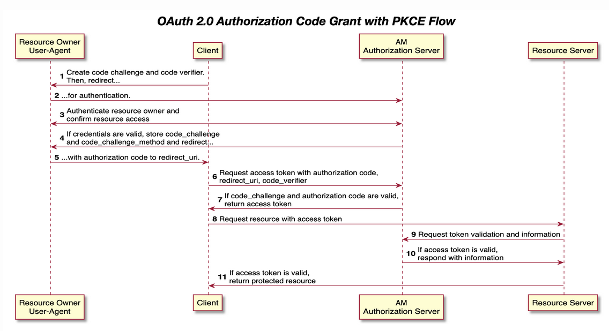

# PKCE Authorization Code Flow

PKCE (Proof Key for Code Exchange) is an extension to the authorization code flow to prevent CSRF and authorization code injection attacks.

Additional actions by PKCE to traditional authorization code flow:
1. Client first creates a secret pair (`code_verifier` and `code_challenge`) by a `code_challenge_method` on each authorization request
2. Authorization server stores the `code_challenge` and `code_challenge_method`.
3. Client sends `code_verifier` to authorization server when exchanging the authorization code for an access token
4. authorization server uses stored `code_challenge` and `code_challenge_method` to verify the sent `code_verifier`.

The PKCE flow adds three parameters on top of those used for the Authorization code grant:

* code_verifier

Contains a random string that correlates the authorization request to the token request.

* code_challenge

Contains a string derived from the code verifier that is sent in the authorization request, and that needs to be verified later with the code verifier.

* code_challenge_method

Contains an encryption/decryption algo name.