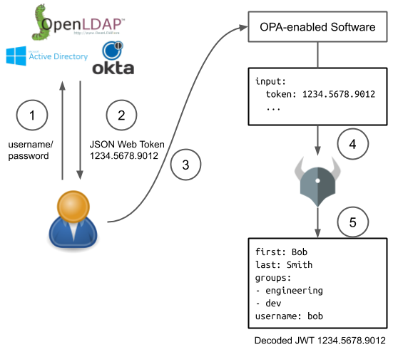

# Open Policy Agent (OPA) 

**Reference**:
https://www.openpolicyagent.org/docs/latest/

OPA (pronounced “oh-pa”)  is an open source, general purpose policy engine, providing a high-level declarative language that lets you specify policy as code and simple APIs to offload policy decision-making.

The high-level declarative language for OPA is called `Rego`.

Basically, OPA works as below. Service is what end users interact with an application. The application translates user's request into json for OPA for decision making.


### For example,
`Data` defines allowed used server protocols and ports.
```json
{
    "servers": [
        {
            "id": "app", 
            "protocols": ["https", "ssh"], 
            "ports": ["p1", "p2", "p3"]
        },
        {
            "id": "db", 
        "protocols": ["mysql"], 
        "ports": ["p3"]
        }
    ]
}
```

`Policy` defines in `rego` for server violation determination
```bash
package example

default allow = false  

# a server is in the violation set if...
violation[server.id] {
    
    some server

    # it exists in the 'public_server' set and...
    public_server[server]
    
    # it contains the insecure "http" protocol.
    server.protocols[_] == "http"                  
}
```

Run this via cmd
```bash
./opa eval -i Data.json -d Policy.rego "data.example.violation[x]"
```

## LDAP and OPA

**Reference:**
https://www.openpolicyagent.org/docs/latest/external-data/

